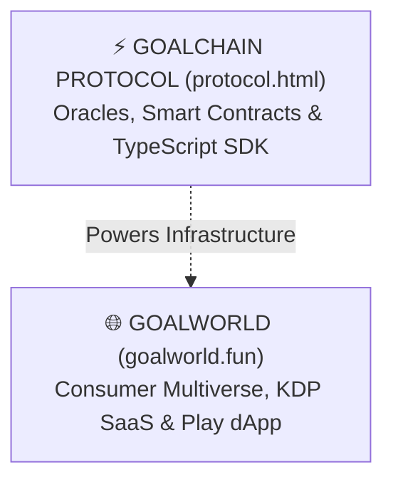

# 🤖 GoalWorld & GoalChain: AI Agent Master Directive

**Source of Truth.** Priority over any other guideline. Read this file before initiating any action.

---

## 🎯 1. Core Vision & Dual Ecosystem Architecture

GoalWorld is the master sovereign ecosystem of **Nico Pez (@nicopez)**. The architecture separates consumer/creative experiences from protocol infrastructure:



1. **`goalworld.fun` (Consumer / Creator Flagship)**:
   - **Nexus de Universos**: Sagas, lore bibles, ranking and on-chain royalties.
   - **Publisher SaaS**: Dual-publish engine (Amazon KDP Print/Kindle + Solana IP Tokenization with 85% Author royalty).
   - **Neural Asset Forge**: AI generation of 3D vinyl figurines, book covers, and lore assets.
   - **Play dApp (`play.goalworld.fun`)**: The interactive Web3 gaming and simulation arena.

2. **`goalchain.fun` (Infrastructure & Protocol Layer - Option A)**:
   - **Sports Oracles**: Low-latency verifiable sports feeds with Jito MEV protection.
   - **Anchor Smart Contracts**: Non-custodial prediction pools and zero-loss vaults (`FbDhM4itBS2Cco7c7PbNvC98Fx7Y5HxqXS1JuXdNcBwg`).
   - **Developer SDK**: `@goalchain/sdk` TypeScript package for builders.

---

## 🏛️ 2. Architectural Non-Negotiables

1. **Single Source of Truth for Economy**: `docs/ECONOMIC_CANONICAL_CONFIG.json`.
2. **Single Source of Truth for IDL**: `goalchain-sdk/src/goalchain_program.json`.
3. **Single Program ID**: `FbDhM4itBS2Cco7c7PbNvC98Fx7Y5HxqXS1JuXdNcBwg`.
4. **Single User Profile & Roadmap**: `ai_context/user_profile.md` & `ai_context/GOALWORLD_MASTER_ROADMAP.md`.
5. **Memory Synchronization**: Durable facts must be recorded in `gbrain` via `remember` with `visibility: world` so Hermes (VPS) and Antigravity share context.
6. **No Secrets in Code**: Never commit or print `.env`, `fcc.secrets.env`, or private keypair files.

---

## 🛠️ 3. Verification & Build Standard

Before declaring any task complete:
```bash
# 1. SDK validation
cd goalchain-sdk && npm run build

# 2. Webapp compilation check (Mandatory)
cd ../goalchain_webapp && npm run build
```
Any TypeScript error or syntax collision in `docs/` is considered a critical failure.
