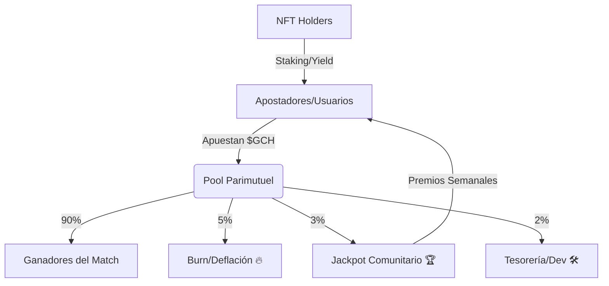

# GOALCHAIN: The Future of Football on Solana 🚀

## 🌟 The Vision
**Dominar el deporte más grande del mundo mediante la descentralización.**
GoalChain no es solo una plataforma de apuestas; es la infraestructura definitiva para el fanático del fútbol del siglo XXI. Nuestra visión es crear un metaverso deportivo donde la pasión no solo se viva, sino que se posea. Imaginamos un futuro donde cada gol en el mundo real active eventos en la blockchain, donde los fans sean dueños de las estadísticas y donde el valor generado por el deporte rey regrese directamente a quienes lo mantienen vivo: la comunidad. Buscamos expandirnos más allá del Mundial, integrando ligas europeas, sudamericanas y competiciones globales, convirtiéndonos en el estándar de facto para el "Football Finance" (FootFi).

## ⚡ The Opportunity
**El Mundial 2026 es el catalizador perfecto.**
Estamos ante la convergencia de tres tormentas perfectas:
1. **Adopción Masiva de Solana:** Con su velocidad y costos ínfimos, es la única cadena capaz de soportar millones de micro-apuestas en tiempo real.
2. **El Evento más Grande de la Historia:** El Mundial 2026 será el primero con 48 selecciones, capturando una audiencia global sin precedentes.
3. **Fatiga de la Web2:** Los usuarios están cansados de casas de apuestas opacas, retiros bloqueados y cuotas manipuladas. GoalChain ofrece la transparencia radical que el mercado exige *ahora mismo*. Quien domine este nicho en el 2026, dominará la industria durante la próxima década.

## ⚖️ Problem vs Solution
| Problem (Traditional Betting) | GoalChain Solution (Web3) |
| :--- | :--- |
| **Opacidad:** No sabes cómo se calculan las cuotas. | **Transparencia:** Lógica parimutuel 100% On-Chain. |
| **Custodia:** Tus fondos están en manos de un tercero. | **No-Custodial:** Apuestas directo desde tu wallet. |
| **Fricción:** Procesos de retiro lentos y tediosos. | **Instantáneo:** Pagos automáticos al finalizar el match. |
| **Centralización:** La casa siempre gana y controla todo. | **Comunidad:** El 10% de los fees vuelve al Jackpot. |

*El sistema tradicional está diseñado para que el usuario pierda. GoalChain está diseñado para que el ecosistema crezca. Al eliminar intermediarios innecesarios, devolvemos el margen de beneficio a los jugadores y a los holders del token.*

## 💎 Genesis Squad NFTs
**Más que simples coleccionables, son tu llave al reino.**
Nuestra colección de 100 leyendas (Genesis Squad) no es solo arte 3D; es un activo productivo:
- **Yield Diario:** Generan tokens $GCH de forma pasiva solo por holdear.
- **Multiplicador de Apuestas:** Mejores cuotas y límites más altos para los poseedores.
- **Gobernanza:** Voto prioritario en la DAO sobre futuros desarrollos y patrocinios.
- **Acceso VIP:** Entradas para eventos del Mundial y merchandising exclusivo.
- **Stamina System:** Los NFTs tienen una barra de energía que debe gestionarse, creando una capa de estrategia similar a la gestión de un equipo real.

## 📝 Professional Contract (P.C.)
**Eleva tu juego al nivel institucional.**
El Contrato Profesional permite a los usuarios avanzados actuar como "Nodes de Liquidez" o capitanes de comunidad:
- **RevShare:** Obtén un porcentaje de las apuestas de tus referidos de forma vitalicia.
- **White Label Solutions:** Capacidad de crear tus propios mini-pools de apuestas dentro de nuestra infraestructura.
- **Dashboard Avanzado:** Herramientas de analítica y predicción basadas en IA integradas en la dApp.

## 📊 Tokenomics: El Flujo Circular
GoalChain utiliza un modelo de **Equilibrio Dinámico**:
1. **Entrada de Capital:** Los usuarios compran $GCH para apostar o adquirir NFTs.
2. **Circulación:** Las apuestas alimentan los pools.
3. **Extracción Sostenible:** El 10% de cada apuesta se divide: 5% quema (deflación), 3% Jackpot Comunitario, 2% Tesorería.
4. **Incentivos:** El Yield de los NFTs y los premios del Jackpot mantienen la demanda del token alta, incluso en periodos de baja volatilidad.

## 🌀 Economía Circular: El Flywheel de GoalChain

El modelo económico de GoalChain está diseñado para ser autosustentable y generar valor constante al token $GCH.

### Flujo de Fondos (NFT Sales & Fees)
Todo ingreso generado por la venta de la **Genesis Squad** y las comisiones de apuestas se distribuye de forma sistémica:

1.  **40% - Jackpot & Oráculo**: Financia los premios de las apuestas y asegura que el ecosistema siempre tenga liquidez para pagar a los ganadores.
2.  **30% - Estrategia de Buy-back & Burn**: Compras automáticas de $GCH en el mercado para ser quemados permanentemente, reduciendo la oferta y presionando el precio al alza.
3.  **30% - Ecosistema & Operaciones**: Desarrollo continuo, mantenimiento del oráculo y expansión del equipo.

### El Motor Deflacionario Infinito (The Infinity Burn)
A diferencia de otros proyectos, GoalChain no gasta su capital. El 30% destinado a recompras se deposita en protocolos de **Staking de Alto Rendimiento (SOL/BTC)**:
*   **Principal Intocable**: El tesoro crece perpetuamente como una reserva de valor.
*   **Yield-Powered Buy-back**: Solo los intereses generados se utilizan para la recompra y quema de $GCH, creando una presión de compra infinita.

### La Meta Maestra: Tokenización Global
Nuestra visión a largo plazo es la **digitalización de cada atleta del planeta**. GoalChain no se detendrá en la Genesis Squad; aspiramos a ser el registro oficial de rendimiento Web3 para todas las ligas del mundo, convirtiendo cada carrera deportiva en un activo financiero auditable.

---

### 🛡️ Seguridad y Descentralización Total: Un Protocolo Eterno
GoalChain no es una empresa, es un **Protocolo Autónomo e Inmutable**. Hemos diseñado el sistema para que sea resistente a fallos humanos y garantice la seguridad del capital del usuario:

1.  **Contratos Inmutables**: Una vez desplegado y auditado, la autoridad de administración será revocada. Nadie (ni los fundadores) podrá cambiar las reglas, stats o supply de los NFTs.
2.  **Gestión de Fondos Trustless**: El 100% de los ingresos fluye a través de contratos inteligentes auditables. El reparto (40/30/30) es automático y programado en la blockchain, eliminando cualquier riesgo de "Rug-pull" o mala gestión manual.
3.  **Tesorería Soberana**: El fondo de reserva está bloqueado en bóvedas de staking descentralizadas (SOL/BTC). Los fundadores no tienen acceso al capital principal; solo el protocolo puede utilizar el rendimiento para el crecimiento del ecosistema.
4.  **Oráculo de Verdad Colectiva**: Evolucionaremos hacia un sistema de validación comunitaria, asegurando que los resultados deportivos sean inyectados de forma transparente y resistente a la manipulación.

---

## 🗺️ Roadmap: Camino a la Final
- **Q1 2026:** Fundación, Smart Contracts (Anchor), Mini-juego Beta. (Completado)
- **Q2 2026:** Oracle de Fixtures, Auditoría de Seguridad, Landing v2. (En Progreso)
- **Q3 2026 (MAYO-JUNIO):** Token Generation Event (TGE), Mint de Genesis Squad, Apertura del Marketplace.
- **11 JUNIO 2026:** 🚀 LANZAMIENTO OFICIAL (Kick-off Mundial).
- **Q4 2026:** Jackpot Final del Mundial, Expansión a Ligas Europeas.
- **2027:** Modo 5v5 PvP, DAO Governance, Integración con PSG1 (PlaySolana).

## 👥 The Founders
- **Nico Pez (The Mastermind):** El alma del proyecto. Con un recorrido en la blockchain desde 2016, ha participado en innumerables proyectos Web3. Artista de alma, matemático de formación y padre dedicado. Su amor por el fútbol y su visión técnica son el motor de GoalChain.
- **Lucas Bello (The Artist & QA):** El incansable geek. Lucas tiene el control total de la estética y la estabilidad. Es quien ejecuta las pruebas de estrés más despiadadas para asegurar que el sistema sea indestructible bajo presión.
- **Lara Lo Beluzzo (The Senior Dev):** El ojo agudo. Lara es la programadora senior que transforma la visión en código sólido. Experta en resolución de problemas técnicos complejos y encargada de que cada transacción en Solana sea perfecta.
