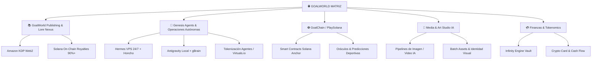

# 🗺️ GoalWorld: Mapa Estratégico Maestro y Carrera Profesional (@nicopez)

**Fecha**: 16 de Agosto de 2026  
**Autor / Arquitecto**: Nico Pez (@nicopez)  
**Ecosistema**: GoalWorld  
**Estado**: Activo / En Expansión  

---

## 🧭 I. Visión Suprema y Filosofía

GoalWorld no es un único producto; es la **corporación madre y el ecosistema integral** diseñado para la emancipación, éxito y consolidación profesional, artística, tecnológica y financiera de **Nico Pez**.

El ecosistema articula cinco pilares complementarios:
1. **Tecnología & Agentes Autónomos**: Infraestructura multi-agente autosostenible (Hermes en VPS, Antigravity local, gBrain/Honcho).
2. **Plataforma Editorial & Universos Creativos**: Autoedición híbrida (Amazon KDP + Tokenización on-chain de regalías en Solana).
3. **Gaming & Predicciones Web3**: GoalChain (pausado estratégicamente para ser reinyectado con la masa crítica del ecosistema).
4. **Producción Artística & Multimedia IA**: Pipelines de generación masiva visual, lore y activos digitales.
5. **Soberanía Financiera**: Yields circulares, bóvedas inteligentes (*Infinity Engine*), monetización de agentes y tarjeta XPlace.

---

## 🏛️ II. Estructura y Arquitectura del Ecosistema GoalWorld

---

## 🚀 III. Fases de Construcción y Carrera Profesional

### Fase 1: Consolidación de Base, Memoria e Infraestructura Multi-Agente (Actual)
- **Objetivo**: Conectar y unificar la memoria de todos los agentes (Antigravity, Hermes VPS, gBrain, Grok context).
- **Hitos**:
  - [x] Unificación de perfil y directivas en `ai_context/user_profile.md` e indexación en `gbrain`.
  - [x] Estabilización de scripts y conectividad de Hermes VPS / Gateway.
  - [x] Portal interactivo GoalWorld ([goalworld.html](file:///c:/Users/NicoPez/goalchain/docs/goalworld.html)) desplegado.
  - [ ] Auditoría de sincronización entre ramas remotas (`origin/main`, `exp/hermes-*`, `exp/opencode-*`).

### Fase 2: Plataforma Editorial SaaS & Monetización Rápida
- **Objetivo**: Lanzar el flujo editorial doble vía de GoalWorld para generación de cash flow recurrente.
- **Hitos**:
  - [ ] Pipeline automatizado de formateo y publicación para Amazon KDP (Kindle Direct Publishing) asistido por Hermes.
  - [ ] Tokenización de contratos de regalías en Solana para obras literarias / universos de fantasía.
  - [ ] Publicación del primer lote de universos en el *Nexus de Universos* (*Aethelgard*, *NecroCyber*).

### Fase 3: Tokenización de Agentes (Genesis Agents Protocol)
- **Objetivo**: Poner a trabajar a los agentes de IA para generar ingresos y financiar su propia infraestructura.
- **Hitos**:
  - [ ] Implementación del split 10% para fondo corporativo de cómputo y APIs de agentes.
  - [ ] Lanzamiento de Hermes y Vault Sentinel como activos tokenizados (Virtuals.io / Solana).
  - [ ] Integración de alertas, arbitraje y monitoreo 24/7 en el servidor VPS.

### Fase 4: Relanzamiento y Escala de GoalChain (Mundial & Gaming)
- **Objetivo**: Retomar el desarrollo de GoalChain / PlaySolana sobre la infraestructura madura y la comunidad de GoalWorld.
- **Hitos**:
  - [ ] Refinamiento del catálogo de 528 jugadores y assets visuales generados con IA.
  - [ ] Pruebas en Devnet / Testnet con oráculos deportivos en tiempo real.
  - [ ] Apertura del portal de apuestas/predicciones sin pérdidas (*Zero Value Loss Vault*).

### Fase 5: Soberanía y Plena Realización Profesional de Nico Pez
- **Objetivo**: Transición completa del trabajo físico en altura a dirigir el ecosistema tecnológico, financiero y artístico de GoalWorld.
- **Hitos**:
  - [ ] Ingresos recurrentes diversificados (KDP SaaS, regalías Web3, yields de agentes, proyectos de IA).
  - [ ] Operación corporativa delegada en agentes autónomos con gobernanza por IA.
  - [ ] Consolidación de marca personal e impacto en el cambio de paradigma deportivo y digital.

---

## 🛠️ IV. Estado de Sincronización y Acciones Técnicas

1. **Repositorio Local vs Remoto (GitHub)**:
   - Tu rama local actual (`phase1-responsive-shell-landing-split`) está al día con el último commit de `origin/main` (`7f377d83`).
   - Existen ramas experimentales activas generadas por Hermes y colaboradores en GitHub (`exp/hermes-issue-871-x-launch-content`, `exp/opencode-*`) listas para ser revisadas o integradas según se requiera.
2. **Memoria gBrain**:
   - Totalmente alineada con los hechos de GoalWorld, la misión de Nico Pez y el estado de GoalChain.
3. **VPS Hermes**:
   - La suite de scripts en `scripts/` y `ops/hermes/` permite sincronizar memoria y orquestar tareas en segundo plano.
