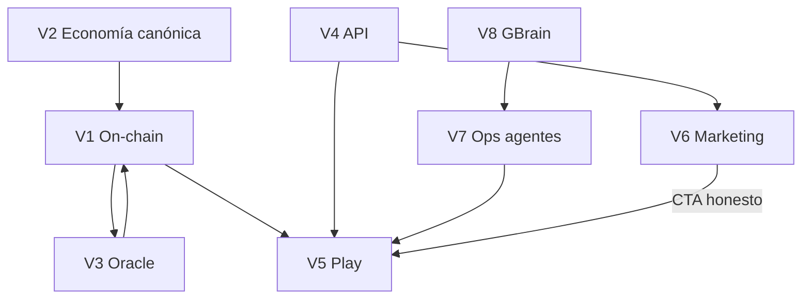

# GoalChain — Plan Maestro (Mundial 2026 → Visión 2027)

**Versión:** 1.0.0-maestro · **Fecha:** 2026-05-26  
**Horizonte:** Demo devnet antes del **11 jun 2026** · Mainnet y tokenización plena **post-Mundial**

Este documento es el **único mapa ejecutivo**. No reemplaza el plan de auditoría en Cursor (`.cursor/plans/`); lo **operacionaliza** en el repo.

---

## Norte (una frase)

**GoalChain = fútbol + economía circular on-chain verificable:** GCH con utilidad real y sinks medibles; NFTs de jugador con rendimiento ligado al oracle; dos superficies honestas (marketing educativo → play transaccional).

---

## Los 8 vértices del sistema

Cada vértice tiene dueño, fuente de verdad, KPI y órdenes en [`docs/governance/VERTEX_REGISTRY.md`](../docs/governance/VERTEX_REGISTRY.md).

| # | Vértice | Paquete / superficie | Dueño merge |
|---|---------|----------------------|-------------|
| V1 | **On-chain** | `goalchain_program` | Antigravity |
| V2 | **Economía canónica** | `docs/ECONOMIC_CANONICAL_CONFIG.json` | Antigravity + Grok review |
| V3 | **Oracle** | `goalchain_oracle` | Antigravity |
| V4 | **API** | `goalchain_api` | Antigravity |
| V5 | **Play** | `goalchain_webapp` → play.goalchain.fun | FCC → Antigravity |
| V6 | **Marketing** | `docs/` → goalchain.fun | Antigravity (docs) |
| V7 | **Ops / agentes** | `ops/hermes`, `ops/goalchain-multiagent`, intake, GitHub | Hermes |
| V8 | **Memoria institucional** | Git + GBrain | Todos (ritual) |

---

## Fases (gates de producción)

| Fase | Ventana | Gate | Documento |
|------|---------|------|-----------|
| **0 Desbloqueo** | Días 1–3 | `main` con merge #26–#34; cola FCC única; Hermes perfil sync | [`docs/intake/2026-05-26-merge-stack-handoff-antigravity.md`](../docs/intake/2026-05-26-merge-stack-handoff-antigravity.md) |
| **1 MVP Mundial** | Días 4–10 | bet → claim devnet &lt; 5 min; badges SIMULACIÓN; economy banner | [`docs/intake/MUNDIAL-2026-MVP.md`](../docs/intake/MUNDIAL-2026-MVP.md) |
| **2 Ops & marketing** | Días 11–17 | goalchain.fun alineado; scope freeze; crons alpha | [`docs/intake/HERMES-MUNDIAL-SCOPE-FREEZE.md`](../docs/intake/HERMES-MUNDIAL-SCOPE-FREEZE.md) |
| **3 Post-Mundial** | Jul–Ago 2026 | Live markets, Genesis Agents, vault real, mainnet audit | [`docs/governance/PARAMETER_EXCELLENCE.md`](../docs/governance/PARAMETER_EXCELLENCE.md) § Post-Mundial |

**Estado código Fase 1 (2026-05-26):** implementado en repo — ver [`docs/IMPLEMENTATION_STATUS.md`](../docs/IMPLEMENTATION_STATUS.md). Merge stack **#26 + #35 merged** (2026-05-23). Pendiente: land Mundial delta, deploy Play, demo E2E CEO. Issue backlog: [`docs/intake/GITHUB_ISSUES_BACKLOG_MUNDIAL_2026.md`](../docs/intake/GITHUB_ISSUES_BACKLOG_MUNDIAL_2026.md).

---

## GCH — camino a moneda codiciada (sin promesas vacías)

| Palanca | Mecanismo on-chain / ops | Fase |
|---------|--------------------------|------|
| Escasez narrativa | Supply acotado + mint gate (`mint_gate.ts`, ops panel) | Mundial (advisory) |
| Quema en flujo real | Fee split en `claim_bet_payout` (burn/jackpot/treasury) | Mundial (devnet demo) |
| Utilidad | Apuestas, stake, rent NFT, builder fund | Mundial / post |
| Buyback | Vault crank → GCH (execute OFF hasta auditoría) | Post-Mundial |
| Transparencia | `GET /api/economy/config` + banner Play | Mundial |

Detalle numérico y ajustes recomendados: [`docs/governance/PARAMETER_EXCELLENCE.md`](../docs/governance/PARAMETER_EXCELLENCE.md).

---

## NFT — valor futuro (diseño, no hype)

| Palanca | Estado | Regla de excelencia |
|---------|--------|---------------------|
| Rarity → yield | On-chain + canonical JSON | Oracle es único que mueve stats |
| Stamina / XI | `oracle_record_match` + daily cap | Idempotente; no doble drenaje |
| Rent 70/25/5 | Implementado | UI post-Mundial read-only primero |
| Genesis Agents | Protocolo doc | **Congelado** hasta post-Mundial |
| Forge inflacionario | No-op / prohibido en prod | No reactivar sin brief P0 |

---

## CEO (Nico) — interfaz mínima

Solo tres comandos a Hermes (`prioridad` | `dispatch` | `estado`). Resto delegado.

**Esta semana (orden sugerido):**
1. Aprobar merge #26→#34 (Antigravity).
2. Una demo devnet bet→claim ([`docs/intake/MUNDIAL-2026-DEMO-RUNBOOK.md`](../docs/intake/MUNDIAL-2026-DEMO-RUNBOOK.md)).
3. Reiniciar Cursor/Antigravity tras GBrain; no tocar MCP en caliente.

Directivas completas: [`docs/governance/AGENT_DIRECTIVES.md`](../docs/governance/AGENT_DIRECTIVES.md).

---

## Índice de gobernanza

| Documento | Uso |
|-----------|-----|
| [`docs/governance/MASTER_PLAN_INDEX.md`](../docs/governance/MASTER_PLAN_INDEX.md) | Tabla de contenidos |
| [`docs/governance/VERTEX_REGISTRY.md`](../docs/governance/VERTEX_REGISTRY.md) | Vértices + KPI + links |
| [`docs/governance/PARAMETER_EXCELLENCE.md`](../docs/governance/PARAMETER_EXCELLENCE.md) | Parámetros GCH/NFT |
| [`docs/governance/AGENT_DIRECTIVES.md`](../docs/governance/AGENT_DIRECTIVES.md) | Órdenes por agente |
| [`docs/governance/STRUCTURE_PROPOSAL.md`](../docs/governance/STRUCTURE_PROPOSAL.md) | Cambios de estructura repo |
| [`ai_context/AGENT_ORCHESTRATION.md`](AGENT_ORCHESTRATION.md) | Pipeline multi-agente |
| [`docs/IMPLEMENTATION_STATUS.md`](../docs/IMPLEMENTATION_STATUS.md) | Verdad código ↔ docs |

---

## Métricas de éxito (11 jun 2026)

| Dimensión | Meta |
|-----------|------|
| Producto | Demo bet→claim &lt; 5 min (Nico, devnet) |
| Honestidad | 0 mock sin badge fuera de /estadio on-chain |
| Técnico | Build webapp verde; oracle_record_match en logs FT |
| Ops | `#hermes` responde; cola FCC ≤ 3 ítems Mundial |
| CEO | &lt; 15 min/semana config |

---

*Actualizar este archivo solo cuando cambie fase o norte. Cambios tácticos van a `docs/intake/`.*
