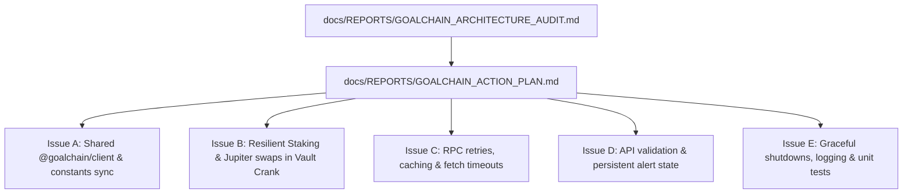

# GoalChain Production Readiness Action Plan

Based on the Principal Staff Engineer Code Audit (`docs/REPORTS/GOALCHAIN_ARCHITECTURE_AUDIT.md`), this document details the Action Plan to resolve all identified architectural, error-handling, transaction, and security vulnerabilities across the codebase.

---

## Task Matrix & Fleet Division

We have broken down the audit checklist into 5 modular, independent tasks. These will be deployed as GitHub issues labeled `agent:opencode` and `status:ready` to be processed concurrently by the 24-worker Greek autonomous fleet.

---

## Comprehensive Implementation Details

### Issue A: Extract Shared Client Logic & Sync Constants
*   **Goal:** Re-use PDA seeds, client logic, and account fetch models to prevent SDK-API-Oracle divergence.
*   **Action Items:**
    1. Export all PDA `SEEDS` and helper classes from `goalchain-sdk` so the Oracle does not duplicate seeds like `"global-config"`.
    2. Consolidate Anchor account type models into a shared client layer to prevent endpoint crashes if the IDL changes.

### Issue B: Resilient Staking & Jupiter Swap Fallback
*   **Goal:** Protect mainnet assets by removing unsafe fallbacks and verifying transactions.
*   **Action Items:**
    1. Replace the `SystemProgram.transfer` fallback (which burns SOL directly) with a validated transaction or explicit throw.
    2. Add preflight simulation (`simulateTransaction`) before submitting mainnet transactions.
    3. Ensure Jupiter swap logic works with Versioned Transactions and handles token-burning correctly.

### Issue C: RPC Retries, Caching & Timeouts
*   **Goal:** Ensure resilience under RPC rate limits and high Solana congestion.
*   **Action Items:**
    1. Implement request timeouts with `AbortController` on all Helius and Jupiter API calls.
    2. Implement a retry wrapper with exponential backoff around `sendAndConfirmTransaction` and RPC fetches.
    3. Implement a 10-second TTL cache for computed priority fees in `priorityFees.ts`.

### Issue D: API Validation & Persistent Alert State
*   **Goal:** Guard the Express backend from crashing due to malicious inputs or file read errors.
*   **Action Items:**
    1. Wrap all synchronous file-loading calls (`fs.readFileSync`) in try-catch blocks.
    2. Add Zod or Joi validation middleware to Express endpoints to sanitize inputs.
    3. Persist `healthAlertState` using a lightweight SQLite or Redis store to prevent data loss on container restarts.

### Issue E: Graceful Shutdowns, Logging & Unit Tests
*   **Goal:** Improve observability and cleanup operations during daemon stops.
*   **Action Items:**
    1. Register `SIGTERM` and `SIGINT` signal listeners in the Oracle daemon to close network resources.
    2. Standardize logging with a structured logging library (e.g. `pino` or `winston`).
    3. Add Jest unit tests for utility functions such as `parseCsv` and calculations in `index.ts`.
