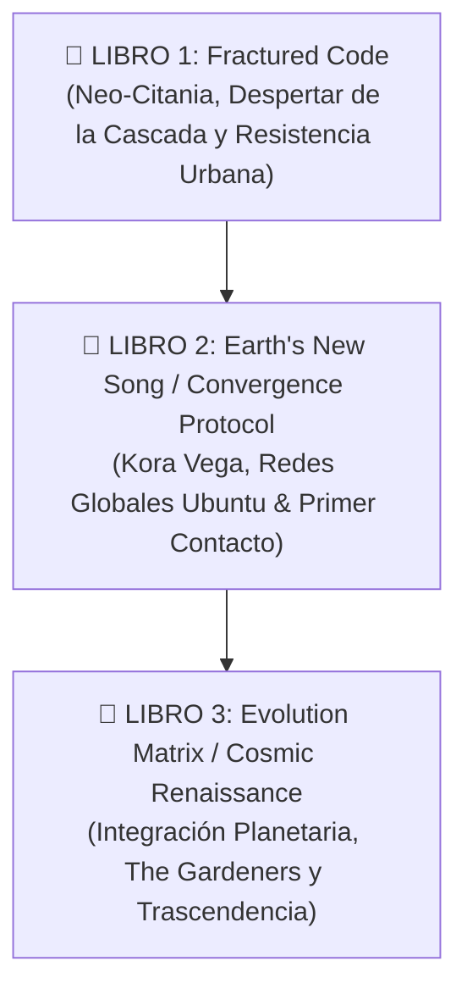

# 🖋️ The Neural Wars Trilogy: Directiva Editorial de Reescritura & Elevación 2026

**Para uso exclusivo de Agentes IA (Hermes Swarm, Antigravity, Claude Code, OpenCode).**  
Este documento establece los estándares de calidad literaria para la revisión, reescritura y publicación de la trilogía *The Neural Wars*.

---

## 🎯 1. Diagnóstico de Versiones Previas (2025) vs. Estándar 2026

Hace un año, los modelos de lenguaje tendían a:
* Usar fórmulas repetitivas y adjetivación excesiva (*"un escalofrío recorrió su espalda"*, *"la tensión era palpable"*).
* Diálogos expositivos donde los personajes explican la trama en vez de hablar como personas reales con intenciones ocultas.
* Ritmo plano y falta de subtexto psicológico.

### 🌟 El Nuevo Estándar Editorial 2026:
1. **Mostrar, no contar (*Show, Don't Tell*)**: Transmitir el impacto de la tecnología neural a través de sensaciones físicas, fallos de percepción sensorial y dilemas éticos viscerales.
2. **Subtexto y Tensión Dinámica**: Las conversaciones deben tener agendas dobles, silencios cargados y lenguaje callejero mezclado con jerga cibernética de Neo-Citania.
3. **Coherencia Absoluta con el Canon**: Respetar las reglas de la Cascada, el Protocolo Renacimiento y la presencia cósmica de *The Gardeners*.

---

## 📚 2. La Trilogía: Arquitectura de 3 Tomos

---

## 🛠️ 3. Protocolo de Trabajo por Capítulos para Agentes IA

Para cada capítulo asignado a un agente:
1. **Paso 1 (Lectura de Ingesta)**: Leer el capítulo original en `BOOK_01_FRACTURED_CODE/MANUSCRIPT/` y el perfil del personaje en `00_SERIES_BIBLE_AND_CANON/`.
2. **Paso 2 (Reescritura de Prosa)**: Elevar el vocabulario, pulir el ritmo de las escenas de acción e inyectar profundidad sensorial.
3. **Paso 3 (Auditoría de Canon con gBrain)**: Comprobar que no haya contradicciones con la biblia de la saga.
4. **Paso 4 (Salida KDP & Token)**: Formatear con los estándares de imprenta Amazon KDP y metadatos de regalías para Solana.
